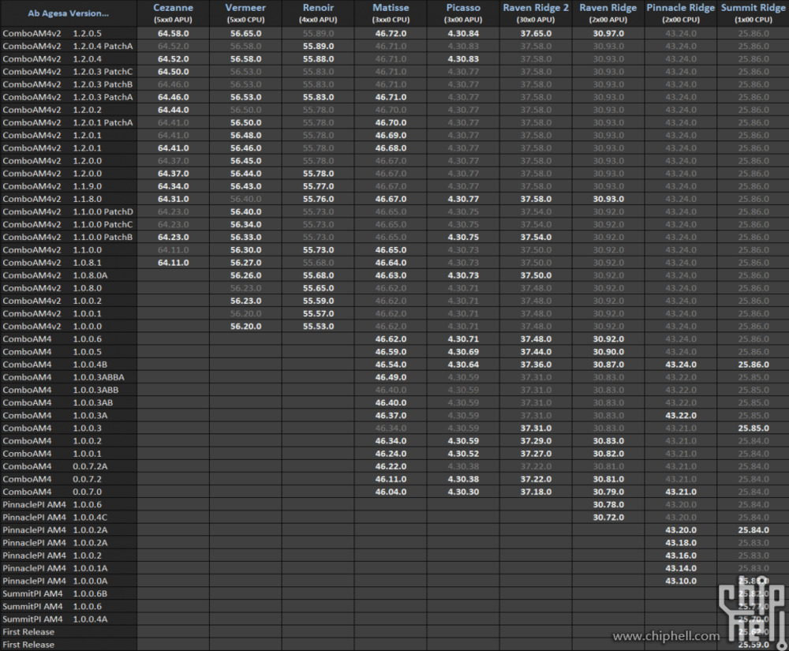

# Ryzen SMU

 

<small>*N.B. Images above shows the potential capabilities of this driver, retrieved using the
[monitor_cpu](userspace/monitor_cpu.c)* utility. Other processors will require tweaking on the
user's part or additional tools.</small>

**Ryzen SMU** is a Linux kernel driver that exposes access to the SMU (System Management Unit) for
certain AMD Ryzen Processors. ***Use at your own risk, the author takes no responsibility over
potential damages that may result from the misuse of this driver or programs dependent upon it.***

The following processor code names are supported:

- [Colfax](https://en.wikichip.org/wiki/amd/cores/colfax)
- [Renoir](https://en.wikichip.org/wiki/amd/cores/renoir)
- [Picasso](https://en.wikichip.org/wiki/amd/cores/picasso)
- [Matisse](https://en.wikichip.org/wiki/amd/cores/matisse)
- [Castle Peak](https://en.wikichip.org/wiki/amd/cores/castle_peak)
- [Raven Ridge](https://en.wikichip.org/wiki/amd/cores/raven_ridge)
- [Raven Ridge 2](https://www.techpowerup.com/gpu-specs/amd-raven-2.g888)
- [Summit Ridge](https://en.wikichip.org/wiki/amd/cores/summit_ridge)
- [Pinnacle Ridge](https://en.wikichip.org/wiki/amd/cores/pinnacle_ridge)
- [Rembrandt](https://en.wikichip.org/wiki/amd/cores/rembrandt)
- [Vermeer](https://en.wikichip.org/wiki/amd/cores/vermeer)
- [Vangogh](https://en.wikichip.org/wiki/amd/cores/vangogh)
- [Cezanne](https://en.wikichip.org/wiki/amd/cores/cezanne)
- [Milan](https://en.wikichip.org/wiki/amd/cores/milan)
- [Dali](https://en.wikichip.org/wiki/amd/cores/dali)

In addition, for the following models, the power metrics/monitoring (PM) table (seen in screenshot)
can also be accessed:

- Vermeer ( Ryzen 5000 Desktop Series )
- Matisse ( Ryzen 3000 Desktop Series )
- Cezanne ( Ryzen 5000[GE] APU Series )
- Renoir ( Ryzen 4000[UGHS] APU Series )
- Picasso ( Ryzen 3000[UGHS] APU Series )
- Raven Ridge ( Ryzen 2000[GEU] APU Series )
- Raven Ridge 2

When loaded, the driver exposes several files under sysfs which can only be read with root
permissions (for obvious reasons) at the root path `/sys/kernel/ryzen_smu_drv`:

- `drv_version`
- `version`
- `mp1_if_version`
- `codename`
- `smu_args`
- `mp1_smu_cmd`
- `smn`
- `rsmu_cmd` (Not present on `Rembrandt`, `Vangogh`)

For supported PM table models where RSMU is also supported, the following files are additionally
exposed:

- `pm_table_version`
- `pm_table_size`
- `pm_table`


## Installation

The kernel module may be installed either by DKMS or manually building and inserting the module.

Be sure kernel headers, dev utilities such as `gcc` and `make` are installed beforehand.

### Ubuntu / Debian

```sh
sudo apt install dkms git build-essential linux-headers-$(uname -r)
git clone https://gitlab.com/leogx9r/ryzen_smu.git
cd ryzen_smu

sudo make dkms-install
```

### Arch Linux

Available on the [AUR](https://aur.archlinux.org/packages/ryzen_smu-dkms-git/).

Install it using your AUR helper of choice, example:

```sh
yay -S ryzen_smu-dkms-git
```

### Stand-alone Installation

The module may be built and inserted into the running kernel manually as follows:

```sh
git clone https://gitlab.com/leogx9r/ryzen_smu.git
cd ryzen_smu

make
sudo insmod ryzen_smu.ko
```

## Auto-Loading On System Startup

Assuming you are using `systemd`, the kernel module may be loaded automatically upon system startup
using [`modules-load.d`](https://www.freedesktop.org/software/systemd/man/modules-load.d.html) by
adding the module name to `/etc/modules-load.d/<name>.conf`

Example:

```sh
# /etc/modules-load.d/ryzen_smu.conf
# Load ryzen_smu driver upon startup
ryzen_smu
```

## Confirming Module Works

Upon loading the module, you should see output in your `dmesg` window listing the SMU version:

```sh
# dmesg

...
[1091.154018] ryzen_smu: CPUID: family 0x17, model 0x71, stepping 0x0, package 0x2
[1091.154385] ryzen_smu: SMU v46.54.0
...
```

After which you can verify the existence of the sysfs files and attempt to read them:

```
# ls -lah /sys/kernel/ryzen_smu_drv
total 0
drwxr-xr-x  2 root root    0 May  7 03:01 ./
drwxr-xr-x 14 root root    0 May  7 03:01 ../
-r--------  1 root root 4.0K May  7 03:12 codename
-r--------  1 root root 4.0K May  7 03:12 drv_version
-r--------  1 root root 4.0K May  7 03:10 mp1_if_version
-rw-------  1 root root 4.0K May  7 03:10 mp1_smu_cmd
-r--------  1 root root 4.0K May  7 03:12 pm_table
-r--------  1 root root 4.0K May  7 03:12 pm_table_size
-r--------  1 root root 4.0K May  7 03:12 pm_table_version
-rw-------  1 root root 4.0K May  7 03:10 rsmu_cmd
-rw-------  1 root root 4.0K May  7 03:10 smn
-rw-------  1 root root 4.0K May  7 03:10 smu_args
-r--------  1 root root 4.0K May  7 03:01 version

# cat /sys/kernel/ryzen_smu_drv/version          
SMU v46.54.0

# cat /sys/kernel/ryzen_smu_drv/mp1_if_version
2

# cat /sys/kernel/ryzen_smu_drv/codename
4

# cat /sys/kernel/ryzen_smu_drv/drv_version
0.0.1

```

Following which, you can run the [test.py script](scripts/test.py) to verify that SMU and SMN
functionality is working:

```
# python3 scripts/test.py
Retrieved SMU Version: v46.54.0
Processor Code Name: Matisse
PM Table: [Supported/Unsupported]
SMN Offset[0x50200]: 0x00001539

Everything seems to be working properly!

```

## Explaining Sysfs Files

#### `/sys/kernel/ryzen_smu_drv/drv_version`

Lists the string-representation of the driver (and thus interface) version. For userspace
applications, they should make sure this version is within the expected range.

#### `/sys/kernel/ryzen_smu_drv/version`

Lists the current SMU firmware version in relation to the currently installed
[AGESA](https://en.wikipedia.org/wiki/AGESA).

The following are several lists of SMU to AGESA versions:



Note: This file returns a string encoded version represented by the "SMU Version" above.

#### `/sys/kernel/ryzen_smu_drv/mp1_if_version`

Lists the interface version for the MP1 mailbox.

This can range from v9 to v13 and is indicated by the following table:

| Value | Interface Version |
|:-----:|:-----------------:|
| 0     | v9                |
| 1     | v10               |
| 2     | v11               |
| 3     | v12               |
| 4     | v13               |
| 5     | Undefined         |

Note: This file returns a string representation of the "Value" field above.

#### `/sys/kernel/ryzen_smu_drv/codename`

Returns a numeric index containing the running processor's codename based on the following
enumeration:

| Hex | Decimal | Code Name      |
|:---:|:-------:|:--------------:|
| 00h | 0       | Unknown        |
| 01h | 1       | Colfax         |
| 02h | 2       | Renoir         |
| 03h | 3       | Picasso        |
| 04h | 4       | Matisse        |
| 05h | 5       | Threadripper   |
| 06h | 6       | Castle Peak    |
| 07h | 7       | Raven Ridge    |
| 08h | 8       | Raven Ridge 2  |
| 09h | 9       | Summit Ridge   |
| 0Ah | 10      | Pinnacle Ridge |
| 0Bh | 11      | Rembrandt      |
| 0Ch | 12      | Vermeer        |
| 0Dh | 13      | Vangogh        |
| 0Eh | 14      | Cezanne        |
| 0Fh | 15      | Milan          |
| 10h | 16      | Dali           |

Note: This file returns 2 characters of the 'Decimal' encoded index.

#### `/sys/kernel/ryzen_smu_drv/rsmu_cmd` or `/sys/kernel/ryzen_smu_drv/mp1_smu_cmd`

This file allows the user to initiate an RSMU or MP1 SMU request. It accepts either an 8-bit or
32-bit command ID that is platform-dependent.

When this file is read, it produces the result on the status of the operation, as a 32 bit
little-endian encoded value.

The SMU returns the following possible values which indicate the result of a command execution:

| Hex | Decimal | Explanation                   |
|:---:|:-------:|:-----------------------------:|
| 00h | 0       | WAITING                       |
| 01h | 1       | OK                            |
| FFh | 255     | FAILED                        |
| FEh | 254     | UNKNOWN COMMAND               |
| FDh | 253     | REJECTED - PREREQUISITE UNMET |
| FCh | 252     | REJECTED - BUSY               |

In addition to this, several custom error codes are also implemented by the driver:

| Hex | Decimal | Explanation                   |
|:---:|:-------:|:-----------------------------:|
| FBh | 251     | COMMAND TIMEOUT               |
| FAh | 250     | INVALID ARGUMENT              |
| F9h | 249     | UNSUPPORTED PLATFORM          |
| F8h | 248     | INSUFFICIENT BUFFER SIZE      |
| F7h | 247     | MEMORY MAP ERROR              |
| F6h | 246     | PCI PROGRAMMING ERROR         |


#### `/sys/kernel/ryzen_smu_drv/smu_args`

When written to, this file accepts 6x 32-bit words (a total of 192 bits) that specify the arguments
used when executing an SMU command.

When read from, it lists either:

- The last values that were written to it before an SMU request was initiated
- The responses from the SMU after a request was completed

Note: All values sent to and read from this file must be in 6x 32-bit words encoded in little-endian
order, arguments numbered from 1 to 6.

#### `/sys/kernel/ryzen_smu_drv/smn`

Allows reading and writing 32 bit values from the SMN address space. To perform an operation, write
a value then read the file for the result.

The amount of bytes written indicates the operation performed:

| Bits Written | Operation | Action Taken                                                                 |
|:------------:|:---------:| ---------------------------------------------------------------------------- |
| 32           | Read      | Reads 32 bit address and returns the result                                  |
| 64           | Write     | Writes the second 32-bit value to the address specified by the first 32 bits |

Note: All values sent to and read from the device must are in little-endian binary format.

#### `/sys/kernel/ryzen_smu_drv/pm_table_size`

On supported platforms, this lists the maximum size of the `/sys/kernel/ryzen_smu_drv/pm_table`
file, in bytes.

Note: File is a 64 bit word encoded in little-endian binary order.

#### `/sys/kernel/ryzen_smu_drv/pm_table_version`

On supported platforms, listed in the table below, this indicates the version of the metrics table.

Each version corresponds to a specific table size and layout that differs across processors.

The following table lists the known characteristics per version:

| Hex      | Platform    | Table Size (Hex) |
|:--------:|:-----------:|:----------------:|
| 0x1E0004 | Raven Ridge | 0x6AC            |
| 0x1E0005 | Raven Ridge | 0x6AC            |
| 0x1E0101 | Raven Ridge | 0x6AC            |
|          |             |                  |
| 0x240802 | Matisse     | 0x7E0            |
| 0x240803 | Matisse     | 0x7E4            |
| 0x240902 | Matisse     | 0x514            |
| 0x240903 | Matisse     | 0x518            |
|          |             |                  |
| 0x2D0803 | Vermeer     | 0x894            |
| 0x380804 | Vermeer     | 0x8A4            |
| 0x380805 | Vermeer     | 0x8F0            |
| 0x2D0903 | Vermeer     | 0x594            |
| 0x380904 | Vermeer     | 0x5A4            |
| 0x380905 | Vermeer     | 0x5D0            |
|          |             |                  |
| 0x370000 | Renoir      | 0x794            |
| 0x370001 | Renoir      | 0x884            |
| 0x370002 | Renoir      | 0x88C            |
| 0x370004 | Renoir      | 0x8AC            |
| 0x370005 | Renoir      | 0x8C8            |
|          |             |                  |
| 0x400005 | Cezanne     | 0x944            |
|          |             |                  |
| 0x2D0008 | Milan       | 0x1AB0           |

Note: File is a 32 bit word encoded in little-endian binary order.

#### `/sys/kernel/ryzen_smu_drv/pm_table`

On supported platforms, this file contains the PM table for the processor, as updated by the SMU.

Note: This file is encoded directly by the SMU and contains an array of 32-bit floating point values
whose structure is determined by the version of the table.

## Module Parameters

The driver supports the following module parameter(s):

#### `smu_timeout_attempts`

When executing an SMU command, either by reading `pm_table` or manually, via `smu_args` and
`smu_cmd`, the driver will retry this many times before considering the command to have timed out.

For example, on slower or busy systems, the SMU may be tied up resulting in commands taking longer
to execute than normal. Allowed range is from `500` to `32768`, defaulting to `8192`.

## Userspace Library

Included in this project is a userspace library, located at [/lib](lib) to allow easy interaction
with the driver. More details of the methods provided may be found in [libsmu.h](lib/libsmu.h).

Example usage of the library is detailed below:

```cpp
#include <stdlib.h>
#include <unistd.h>

#include <libsmu.h>

#define TEST_SMN_ADDR 0x50200

int main(int argc, char** argv) {
    smu_obj_t obj;
    unsigned int result;

    // Userspace library requires root permissions to access driver.
    if (getuid() != 0 && geteuid() != 0) {
        fprintf(stderr, "Program must be run as root.\n");
        exit(-1);
    }

    // Initialize the library for use with the program.
    if (smu_init(&obj) != SMU_Return_OK) {
        fprintf(stderr, "Error initializing userspace library.\n");
        exit(-2);
    }

    printf("Processor Codename: %s\n", smu_codename_to_str(&obj));
    printf("SMU FW: %s\n", smu_get_fw_version(&obj));

    if (smu_read_smn_addr(&obj, TEST_SMN_ADDR, &result) != SMU_Return_OK) {
        fprintf(stderr, "Error reading SMN address: 0x%08x\n", TEST_SMN_ADDR);
        exit(-3);
    }
    printf("SMN [0x%08x]: 0x%08x\n", TEST_SMN_ADDR, result);

    // Cleanup after library use has ended.
    smu_free(&obj);

    return 0;
}
```

N.B. This header file must be compatible with the version of the driver installed.


## Example Usage

For Matisse & Vermeer processors, there are several commands that are known to work. See
[rsmu_commands.md](docs/rsmu_commands.md) for more information.

Commands may be executed either programatically using the library or under a shell by writing to the
designated files.

Example usage via shell:

```sh
# Note: Does not persist across reboots

# Set the running PPT to 142 W (argument in milliwatts)
printf '%0*x' 48 142000 | fold -w 2 | tac | tr -d '\n' | xxd -r -p | sudo tee /sys/kernel/ryzen_smu_drv/smu_args && printf '\x53' | sudo tee /sys/kernel/ryzen_smu_drv/rsmu_cmd

# Set the running TDC to 90 A (argument in milliamps)
printf '%0*x' 48 90000 | fold -w 2 | tac | tr -d '\n' | xxd -r -p | sudo tee /sys/kernel/ryzen_smu_drv/smu_args && printf '\x54' | sudo tee /sys/kernel/ryzen_smu_drv/rsmu_cmd

# Set the running EDC to 140 A (argument in milliamps)
printf '%0*x' 48 140000 | fold -w 2 | tac | tr -d '\n' | xxd -r -p | sudo tee /sys/kernel/ryzen_smu_drv/smu_args && printf '\x55' | sudo tee /sys/kernel/ryzen_smu_drv/rsmu_cmd

# Set the PBO Scalar to 2x
# Calculation: 100 * scalar
printf '%0*x' 48 200 | fold -w 2 | tac | tr -d '\n' | xxd -r -p | sudo tee /sys/kernel/ryzen_smu_drv/smu_args && printf '\x58' | sudo tee /sys/kernel/ryzen_smu_drv/rsmu_cmd
```

As to the rest of the commands, we leave that as an exercise up to the user. :)
