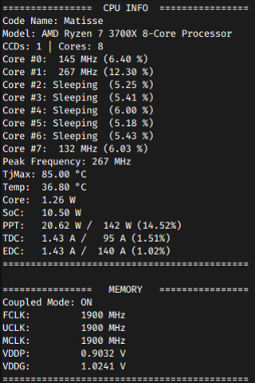

# Ryzen SMU



*Ryzen SMU* is a Linux kernel driver that exposes access to the SMU (System Management Unit) for certain AMD Ryzen Processors.

The following processor code names are supported:

- Colfax
- Renoir
- Picasso
- Matisse
- Threadripper
- Castle Peak
- Raven Ridge
- Raven Ridge 2
- Summit Ridge
- Pinnacle Ridge

In addition, for the following models, the PM table can also be accessed:

- Matisse
- Renoir
- Picasso
- Raven Ridge 2

When loaded, the driver exposes several files under sysfs which can only be read with root permissions (for obvious reasons):

- `/sys/kernel/ryzen_smu_drv/version`
- `/sys/kernel/ryzen_smu_drv/codename`
- `/sys/kernel/ryzen_smu_drv/smu_args`
- `/sys/kernel/ryzen_smu_drv/smu_cmd`
- `/sys/kernel/ryzen_smu_drv/smn`

For supported PM table models, the following files are additionally exposed:

- `/sys/kernel/ryzen_smu_drv/pm_table_size`
- `/sys/kernel/ryzen_smu_drv/pm_table`


## Installation

The kernel module may be installed either by DKMS or manually building and inserting the module.

### Ubuntu / Debian

```
sudo apt install dkms git build-essential linux-headers-$(uname -r)
git clone https://gitlab.com/leogx9r/ryzen_smu.git
cd ryzen_smu

sudo make dkms-install
```

### Stand-alone Installation

The module may be built and inserted into the running kernel manually as follows:

```
git clone https://gitlab.com/leogx9r/ryzen_smu.git
cd ryzen_smu

make
sudo insmod ryzen_smu.ko
```

## Confirming Module Works

Upon loading the module, you should see output in your `dmesg` window listing the SMU version:

```
# dmesg

...
[1091.154385] ryzen_smu: SMU v46.54.0
...
```

After which you can verify the existence of the sysfs files and attempt to read them:

```
# ls -lah /sys/kernel/ryzen_smu_drv
total 0
drwxr-xr-x  2 root root    0 May  7 03:01 ./
drwxr-xr-x 14 root root    0 May  7 03:01 ../
-r--------  1 root root 4.0K May  7 03:12 codename
-r--------  1 root root 4.0K May  7 03:12 pm_table
-r--------  1 root root 4.0K May  7 03:12 pm_table_size
-rw-------  1 root root 4.0K May  7 03:10 smn
-rw-------  1 root root 4.0K May  7 03:10 smu_args
-rw-------  1 root root 4.0K May  7 03:10 smu_cmd
-r--------  1 root root 4.0K May  7 03:01 version

# cat /sys/kernel/ryzen_smu_drv/version          
SMU v46.54.0

# cat /sys/kernel/ryzen_smu_drv/codename
4

```

Following which, you can run the [test.py script](scripts/test.py) to verify that SMU and SMN functionality is working:

```
# python3 scripts/test.py
Retrieved SMU Version: v46.54.0
Processor Code Name: Matisse
PM Table: [Supported/Unsupported]
SMN Offset[0x50200]: 0x00001539

Everything seems to be working properly!

```

## Explaining Sysfs Files

#### `/sys/kernel/ryzen_smu_drv/version`

Lists the current SMU version in relation to the currently installed [AGESA](https://en.wikipedia.org/wiki/AGESA) BIOS.

The following are several lists of SMU to AGESA versions:

| SMU Version   | AGESA Version |
|:-------------:|:-------------:|
| 46.54         | 1.0.0.4 B     |
| 46.53         | 1.0.0.4       |
| 46.49         | 1.0.0.3 ABBA  |
| 46.37         | 1.0.0.3 A     |
| 43.18         | 1.0.0.2 A     |

#### `/sys/kernel/ryzen_smu_drv/codename`

Returns a numeric index containing the running processor's codename based on the following enumeration:

| Hex | Decimal | Code Name      |
|:---:|:-------:|:--------------:|
| 00h | 0       | Unknown        |
| 01h | 1       | Colfax         |
| 02h | 2       | Renoir         |
| 03h | 3       | Picasso        |
| 04h | 4       | Matisse        |
| 05h | 5       | Threadripper   |
| 06h | 6       | Castle Peak    |
| 07h | 7       | Raven Ridge    |
| 08h | 8       | Raven Ridge 2  |
| 09h | 9       | Summit Ridge   |
| 0Ah | 10      | Pinnacle Ridge |

#### `/sys/kernel/ryzen_smu_drv/smu_cmd`

This file allows the user to initiate an SMU request. It accepts either an 8-bit or 32-bit command ID that is platform-dependent.

When this file is read, it produces the result on the status of the operation, in hex:

| Hex | Decimal | Explanation                   |
|:---:|:-------:|:-----------------------------:|
| 00h | 0       | WAITING                       |
| 01h | 1       | OK                            |
| FFh | 255     | FAILED                        |
| FEh | 254     | UNKNOWN COMMAND               |
| FDh | 253     | REJECTED - PREREQUISITE UNMET |
| FCh | 252     | REJECTED - BUSY               |
| FBh | 251     | COMMAND TIMEOUT               |
| FAh | 250     | INVALID ARGUMENT              |
| F9h | 249     | UNSUPPORTED PLATFORM          |

#### `/sys/kernel/ryzen_smu_drv/smu_args`

When written to, this file accepts 6x 32-bit words (a total of 192 bits) that specify the arguments used when executing an SMU command.

When read from, it lists either:

- The last values that were written to it before an SMU request was initiated
- The responses from the SMU after a request was completed

Values read are output as a hexadecimal string consisting of 24 bytes (48 hex string encoded) representing arguments 1-6.

Values written to this file must be in binary (little-endian) format and written ordered in the same way, 1-6.

#### `/sys/kernel/ryzen_smu_drv/smn`

Allows reading and writing 32 bit values from the SMN address space. To perform an operation, write a value then read the file for the result.

The amount of bytes written indicates the operation performed:

| Bits Written | Operation | Action Taken                                                                 |
|:------------:|:---------:| ---------------------------------------------------------------------------- |
| 32           | Read      | Reads 32 bit address and returns the result                                  |
| 64           | Write     | Writes the second 32-bit value to the address specified by the first 32 bits |

All values sent to the device must be in little-endian binary format while read values are output as hexadecimal.

#### `/sys/kernel/ryzen_smu_drv/pm_table_size`

On supported platforms, this lists the maximum size of the `/sys/kernel/ryzen_smu_drv/pm_table` file, in bytes.

#### `/sys/kernel/ryzen_smu_drv/pm_table`

On supported platforms, this file contains the PM table for the processor, as updated by the SMU.

## Module Parameters

The driver supports the following module parameters:

#### `smu_timeout_attempts`

When executing an SMU command, either by reading `pm_table` or manually, via `smu_args` and `smu_cmd`, the driver will retry this many times before considering the command to have timed out.

For example, on slower or busy systems, the SMU may be tied up resulting in commands taking longer to execute than normal. Allowed range is from `500` to `32768` milliseconds, defaulting to `8192`.

#### `smu_pm_update_ms`

When the `pm_table` file is read, the driver first checks for how long since the PM table was last updated, and if it exceeds `smu_pm_update_ms`, the SMU is first told to update the contents before the table is shown.

Accepted ranges are in milliseconds, between `50` and `60000`, defaulting to `1000`. It is generally a good idea to leave this at its default value.